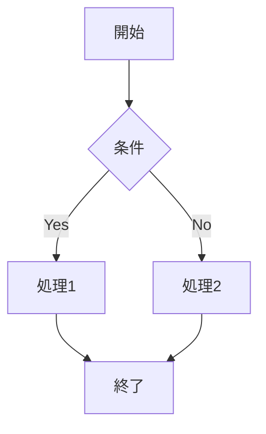
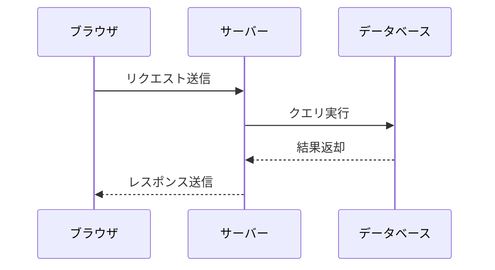
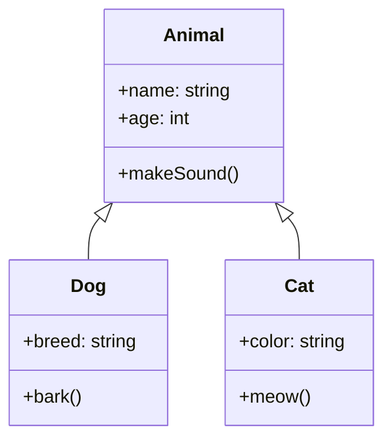

# Mermaid フィルターのテスト

以下は簡単なフローチャートの例です：

```mermaid
graph TD
    A[開始] --> B{条件}
    B -->|Yes| C[処理1]
    B -->|No| D[処理2]
    C --> E[終了]
    D --> E
```

以下はシーケンス図の例です：

```mermaid
sequenceDiagram
    participant ブラウザ
    participant サーバー
    participant データベース

    ブラウザ->>サーバー: リクエスト送信
    サーバー->>データベース: クエリ実行
    データベース-->>サーバー: 結果返却
    サーバー-->>ブラウザ: レスポンス送信
```

以下はクラス図の例です：

```mermaid
classDiagram
    class Animal {
        +name: string
        +age: int
        +makeSound()
    }
    class Dog {
        +breed: string
        +bark()
    }
    class Cat {
        +color: string
        +meow()
    }
    Animal <|-- Dog
    Animal <|-- Cat
```
