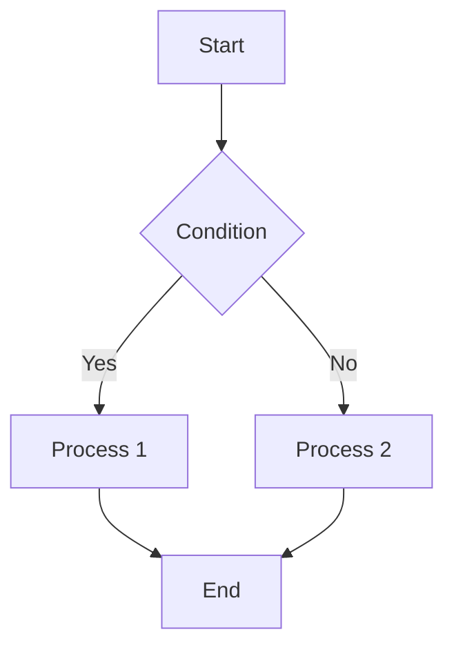
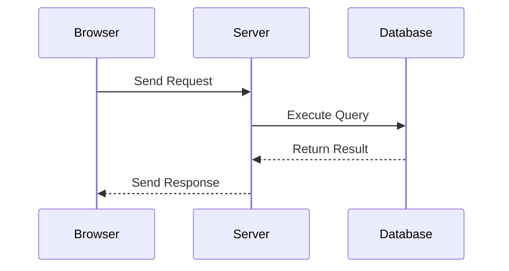
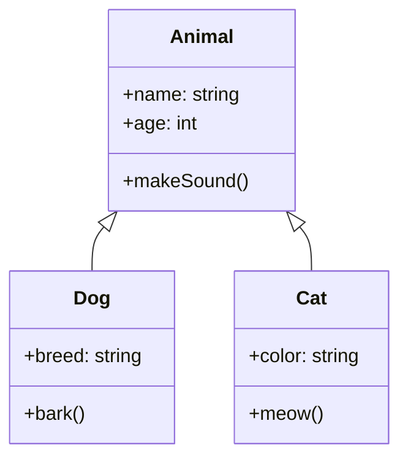

# Testing Mermaid Filter

Here's a simple flowchart example:

```mermaid
graph TD
    A[Start] --> B{Condition}
    B -->|Yes| C[Process 1]
    B -->|No| D[Process 2]
    C --> E[End]
    D --> E
```

Here's a sequence diagram example:

```mermaid
sequenceDiagram
    participant Browser
    participant Server
    participant Database

    Browser->>Server: Send Request
    Server->>Database: Execute Query
    Database-->>Server: Return Result
    Server-->>Browser: Send Response
```

Here's a class diagram example:

```mermaid
classDiagram
    class Animal {
        +name: string
        +age: int
        +makeSound()
    }
    class Dog {
        +breed: string
        +bark()
    }
    class Cat {
        +color: string
        +meow()
    }
    Animal <|-- Dog
    Animal <|-- Cat
```
