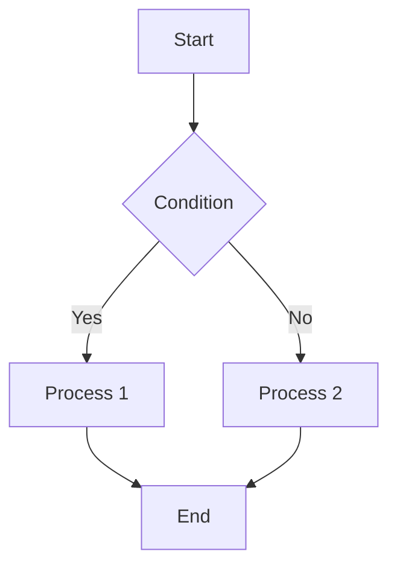
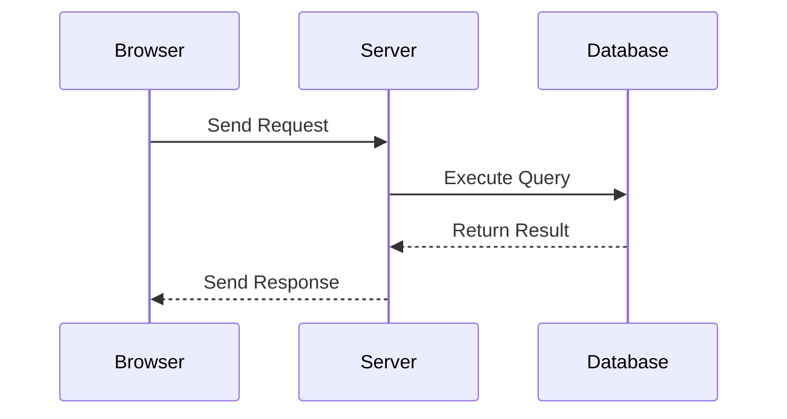
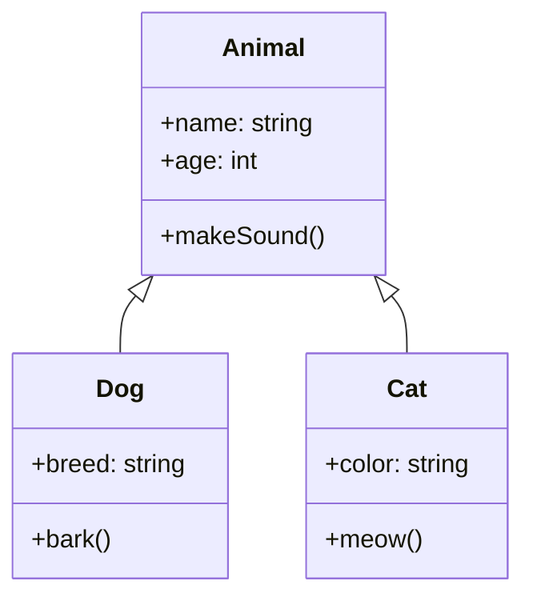

# Testing Mermaid Filter

Here's a simple flowchart example:

\newpage

Here's a sequence diagram example:

\newpage

Here's a class diagram example:

\newpage

Here's a architecture diagram example:

\newpage

Here's a architecture diagram with [@iconify-json/logos](https://icon-sets.iconify.design/logos/) icons example:

```mermaid
architecture-beta
    group api(logos:aws-lambda)[API]

    service db(logos:aws-aurora)[Database] in api
    service disk1(logos:aws-glacier)[Storage] in api
    service disk2(logos:aws-s3)[Storage] in api
    service server(logos:aws-ec2)[Server] in api

    db:L -- R:server
    disk1:T -- B:server
    disk2:T -- B:db
```

\newpage

Here's a architecture diagram with [@iconify-json/mdi](https://icon-sets.iconify.design/mdi/) icons example:

